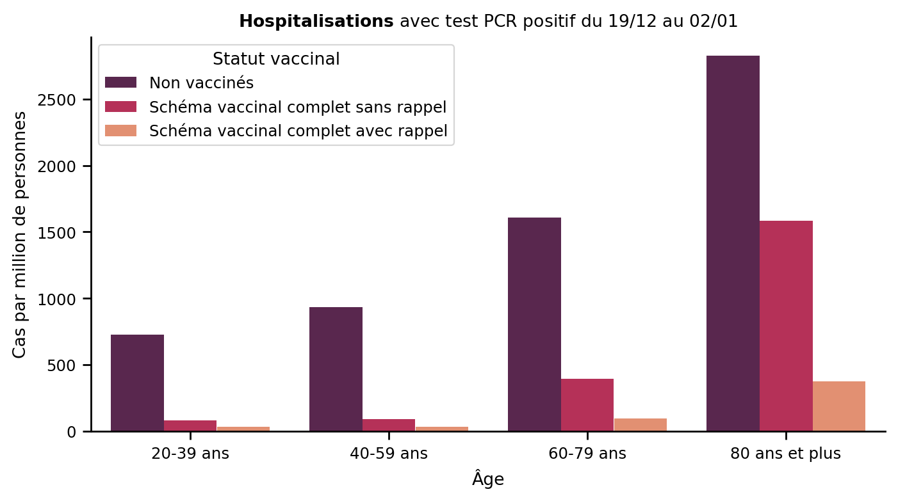

# COVID-19 : cas avec test PCR positif en fonction de l'âge et du statut vaccinal

Code source pour la [page web](https://share.streamlit.io/vivien0000/vaccine-stats/app.py) montrant les nombres de cas COVID-19 avec test PCR positif, au cours des 15 derniers jours connus, pour la France entière et en fonction de l'âge et du statut vaccinal.

Les graphiques sont mis à jour quotidiennement à partir des dernières données mises à disposition par la [DREES](https://data.drees.solidarites-sante.gouv.fr/explore/dataset/covid-19-resultats-par-age-issus-des-appariements-entre-si-vic-si-dep-et-vac-si/information/).

